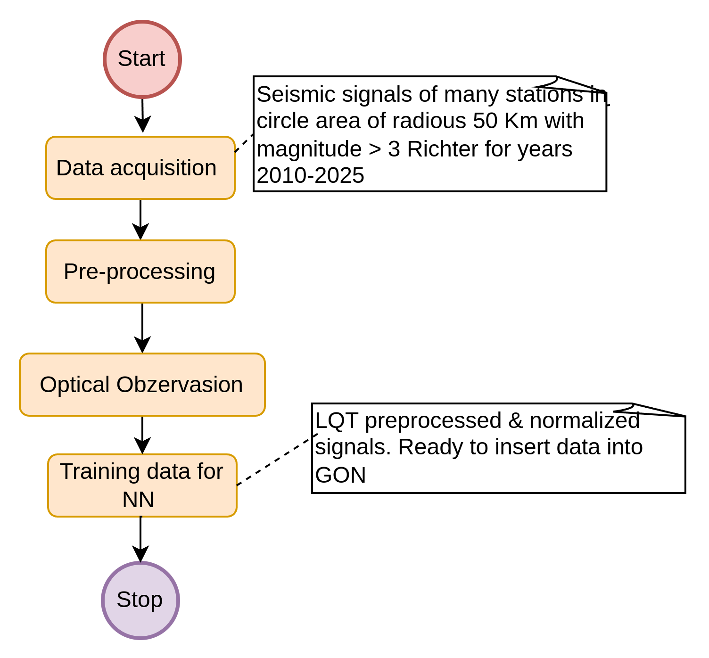

# DataAcquisition Repository

## Overview of Data Acquisition Process

This section describes the detailed functionality and the resulting files generated during the data acquisition procedure. The acquisition process is part of the Data Acquisition task illustrated in the flowchart below.

The waveform data are downloaded directly from an FDSN (Federated Data Service Network) server using the Mass Downloader tool provided by the ObsPy
 framework. This tool enables event-based or continuous waveform acquisition by querying both event catalogs and station metadata, ensuring that the retrieved data are relevant, complete, and scientifically usable.


## Installation

### Installation Prerequisites

Before running the Data Acquisition system, some prerequisite tools must be installed. The most important one is Miniconda
, which is used to manage the Python environment and dependencies of the project.

Miniconda provides a lightweight way to isolate the application's environment, ensuring compatibility and avoiding conflicts with system-wide Python packages.

#### Install Miniconda on Windows/Linux
The following procedure should be executed only once. If you already have installed Conda don't do it again

##### Windows

1. **Download the latest Miniconda installer**:  
   [Miniconda3 Windows 64-bit](https://repo.anaconda.com/miniconda/Miniconda3-latest-Windows-x86_64.exe)

2. **Run the `.exe` file as Administrator**.

3. Choose:
   - Installation type: **Just Me**
   - **Add Miniconda to PATH** (optional but useful)

4. **Complete the installation**.

5. Open **Anaconda Prompt** or **Command Prompt**, and test:
```bash
   conda --version
```

##### Linux

1. Download the latest installer for Linux:
```bash
   wget https://repo.anaconda.com/miniconda/Miniconda3-latest-Linux-x86_64.sh
```
2. Run the installer:
```bash
   bash Miniconda3-latest-Linux-x86_64.sh
```
   Follow the on-screen instructions (press Enter, accept license, choose install location, etc).

3. After installation, run:
```bash
   source ~/.bashrc
   conda --version
```

### Application Setup

Once Miniconda is installed, the Data Acquisition application itself can be set up. This involves cloning the project repository, creating the appropriate Conda environment, and installing all required Python dependencies via requirements.txt or environment.yml.

The project consists of several Python modules that handle waveform downloading, metadata extraction, and event-based folder structuring. After setup, it can be launched from the command line to begin data retrieval from FDSN servers.


#### Clone the Repository
```bash
git clone https://github.com/iarvanitis69/phd_data_acquisition.git
cd phd_data_acquisition
```

#### Activate Basic Conda Environment
You need to activate environment only once

1. Change environment 
```bash
cd phd_data_acquisition
```
2. Install Conda environment/depenndencies
```bash
   conda env create -f environment.yml
```` 
3. Activate Conda environment
```bash
   conda activate phd_cond_env
```
---

## Dual Acquisition Applications

The Data Acquisition system consists of two separate Python-based applications, each tailored to a different type of seismic data retrieval:

### Event-Based Acquisition
This application downloads seismic waveform data related to specific seismic events (e.g., earthquakes). It queries event catalogs and retrieves short waveform windows around each event. This method is particularly effective when focusing on known, cataloged earthquakes and is ideal during the early phases of the project.

### Run the DataAcquisition Project
```bash
cd DataAcquisition
python mainEventBase.py <Year_start> <Year_end>
```
## Execution 

**Example:**
The following command download all events from 2010 to 2025

```bash
python mainEventBase.py 2010 2025 
```
The execution time is about 8 hours with downloading speed of 2 Mbps.

### Description and functionality

For the data acquisition process, we employed an event-based approach using the Mass Downloader tool provided by ObsPy . This tool allows for automated downloading of waveform data and station metadata associated with specific seismic events.
During the download procedure, the tool was configured to query an FDSN-compliant data service using a catalog of predefined earthquake events. For each individual seismic event:
A dedicated folder is created based on the event's origin time, coordinates, depth, and magnitude.
An info.json file is generated, containing the event metadata (origin time, location, magnitude, etc.).
A corresponding StationXML file is saved for each participating station, describing the full instrument response (gain, poles/zeros, location, etc.).
These files are essential for the subsequent instrument correction and signal preprocessing steps. The use of the Mass Downloader enables a reproducible and structured way to collect waveform data and metadata in a consistent format.

#### Seismic Data Acquisition with ObsPy’s Mass Downloader

For the acquisition of seismic data, we employed an event-based download strategy using the Mass Downloader provided by the ObsPy library. This tool allows structured downloading of waveform data and station metadata directly from FDSN-compliant services, based on catalogs of known earthquake events.
During execution, the Mass Downloader creates a consistent and hierarchical folder structure:



Top-level folder: Represents the year (e.g., 2010/)
Event folder: Named using the event's origin time, coordinates, depth, and magnitude (e.g., 20100507T041515_36.68_25.71_15.0km_M3.4/)
Contains an info.json file, which stores event metadata such as origin time, location, magnitude, and depth.
Station subfolders: One for each seismic station involved in recording the event (e.g., HL.APE/, HL.SANT/)
Inside each station folder:
A .mseed file: This is the raw waveform file directly downloaded by the Mass Downloader.
A .xml file (e.g., hlap.xml): The StationXML file containing full metadata and instrument response for the station.
Additionally, within each event subfolder, an info.json file is generated. This file contains a detailed description of the earthquake parameters, including the origin time, latitude, longitude, depth, and magnitude of the event. It serves as a local metadata reference for each downloaded event and is crucial for subsequent processing and analysis steps.

```base
{
  "event_id": "20100507T041515_36.68_25.71_15.0km_M3.4",
  "time_utc": "2010-05-07T04:15:15.100000Z",
  "latitude": 36.6777,
  "latitude_uncertainty_km": 4.2,
  "longitude": 25.7131,
  "longitude_uncertainty_km": 6.7,
  "depth_km": 15.0,
  "depth_uncertainty_km": 1.28,
  "time_uncertainty_sec": 0.21,
  "magnitude": 3.4,
  "downloaded_from": [
    "https://eida.gein.noa.gr"
  ],
  "epicenter_determination": {
    "agency": null,
    "method": "smi:eu.emsc-csem/origin_method/NA",
    "origin_type": "Unknown",
    "evaluation_mode": "manual",
    "evaluation_status": null,
    "earth_model": null
  },
  "interpretation": "Local epicenter determined via arrival-time inversion if HypoInverse/Hypo71 is indicated.",
  "data_attributes": {
    "resource_id": "quakeml:eu.emsc/event/20100507_0000004",
    "origin_resource_id": "quakeml:eu.emsc/event/20100507_0000004/origin/1796266",
    "creation_time": "None",
    "author": null
  },
  "quality_metrics": {
    "used_phase_count": 44,
    "used_station_count": 27,
    "standard_error": 1.28,
    "azimuthal_gap": 64.0,
    "minimum_distance": 0.32,
    "maximum_distance": 3.17,
    "azimuth_max_horizontal_uncertainty": 116.0
  }
}
```

## Bellow we describe all key fields and their explanation

### info.json Field Description

| **Field**                  | **Type**          | **Units**     | **Description**                                                                                                                                             |
| -------------------------- | ----------------- | ------------- | ----------------------------------------------------------------------------------------------------------------------------------------------------------- |
| `event_id`                 | string            | –             | Human‑readable unique identifier for the earthquake, combining time, coordinates, depth, and magnitude. Example: `20100507T041515_36.68_25.71_15.0km_M3.4`. |
| `time_utc`                 | string (ISO 8601) | seconds (UTC) | Origin time of the earthquake in UTC with microsecond precision.                                                                                            |
| `latitude`                 | float             | degrees       | Latitude of the earthquake epicenter (WGS84).                                                                                                               |
| `latitude_uncertainty_km`  | float             | km            | Estimated uncertainty in the latitude of the epicenter.                                                                                                     |
| `longitude`                | float             | degrees       | Longitude of the earthquake epicenter (WGS84).                                                                                                              |
| `longitude_uncertainty_km` | float             | km            | Estimated uncertainty in the longitude of the epicenter.                                                                                                    |
| `depth_km`                 | float             | km            | Hypocentral depth below the Earth’s surface.                                                                                                                |
| `depth_uncertainty_km`     | float             | km            | Estimated uncertainty in the hypocentral depth.                                                                                                             |
| `time_uncertainty_sec`     | float             | s             | Uncertainty in the origin time estimate.                                                                                                                    |
| `magnitude`                | float             | –             | Reported magnitude of the earthquake (e.g., ML, Mw).                                                                                                        |
| `downloaded_from`          | list of strings   | –             | URLs of FDSN/EIDA data services used to download waveform and metadata. Example: `["https://eida.gein.noa.gr"]`.                                            |

### Epicenter Determination

| **Subfield**        | **Type**      | **Description**                                                               |
| ------------------- | ------------- | ----------------------------------------------------------------------------- |
| `agency`            | string / null | Agency that computed the epicenter (may be null).                             |
| `method`            | string        | Method used to compute the origin, e.g., `smi:eu.emsc-csem/origin_method/NA`. |
| `origin_type`       | string        | Type of origin (e.g., hypocenter, centroid, unknown).                         |
| `evaluation_mode`   | string        | Whether the solution was `manual` or `automatic`.                             |
| `evaluation_status` | string / null | Status of the solution (`reviewed`, `preliminary`, or null).                  |
| `earth_model`       | string / null | Seismic velocity model used (e.g., `iasp91`), if known.                       |

### Interpretation
Field	Type	Description

| **Field**        | **Type** | **Description**                                                                                                                                                         |
| ---------------- | -------- | ----------------------------------------------------------------------------------------------------------------------------------------------------------------------- |
| `interpretation` | string   | Textual interpretation describing how the epicenter was determined (e.g., “Local epicenter determined via arrival‑time inversion if HypoInverse/Hypo71 is indicated.”). |

### Data Attributes

| **Subfield**         | **Type**        | **Description**                                                           |
| -------------------- | --------------- | ------------------------------------------------------------------------- |
| `resource_id`        | string          | Unique event identifier from the seismic catalog (e.g., QuakeML or EMSC). |
| `origin_resource_id` | string          | Identifier for the specific origin solution in the catalog.               |
| `creation_time`      | string / "None" | Timestamp when this metadata entry was created.                           |
| `author`             | string / null   | Name of the creator or responsible analyst (may be null).                 |


### Quality Metrics

| **Subfield**                         | **Type** | **Units** | **Description**                                                   |
| ------------------------------------ | -------- | --------- | ----------------------------------------------------------------- |
| `used_phase_count`                   | integer  | –         | Number of arrival phases (P/S) used in locating the event.        |
| `used_station_count`                 | integer  | –         | Number of unique stations contributing to the location.           |
| `standard_error`                     | float    | km        | Root‑mean‑square (RMS) residual error of the location.            |
| `azimuthal_gap`                      | float    | degrees   | Largest angular gap between stations (smaller = better coverage). |
| `minimum_distance`                   | float    | degrees   | Epicentral distance to the nearest station.                       |
| `maximum_distance`                   | float    | degrees   | Epicentral distance to the farthest station.                      |
| `azimuth_max_horizontal_uncertainty` | float    | degrees   | Maximum horizontal uncertainty in epicentral position.            |


---
### Continuous Acquisition
This application downloads long, uninterrupted waveform streams over specified time intervals. It is more suitable when scanning for unknown or uncataloged events, or when aiming to analyze ambient seismic noise, swarms, or microseismicity in greater detail.

Each application has its own strengths and limitations depending on the research goals and computational resources.
For the initial stages of the project, event-based acquisition is the preferred method. However, continuous-based acquisition may become necessary in later stages to supplement the dataset and allow for more comprehensive analyses.


#### Run the DataAcquisition Project
```bash
cd DataAcquisition
python mainContinuous.py <Year_start> <Year_end>
```

#### Execution
Execution time for one year is approximately 1-3 week of continuous  downloading with 2Mbps speed

**Example:**
The following command download all events from 2010 to 2025
```bash
python mainContinuous.py 2010 2025 
```


